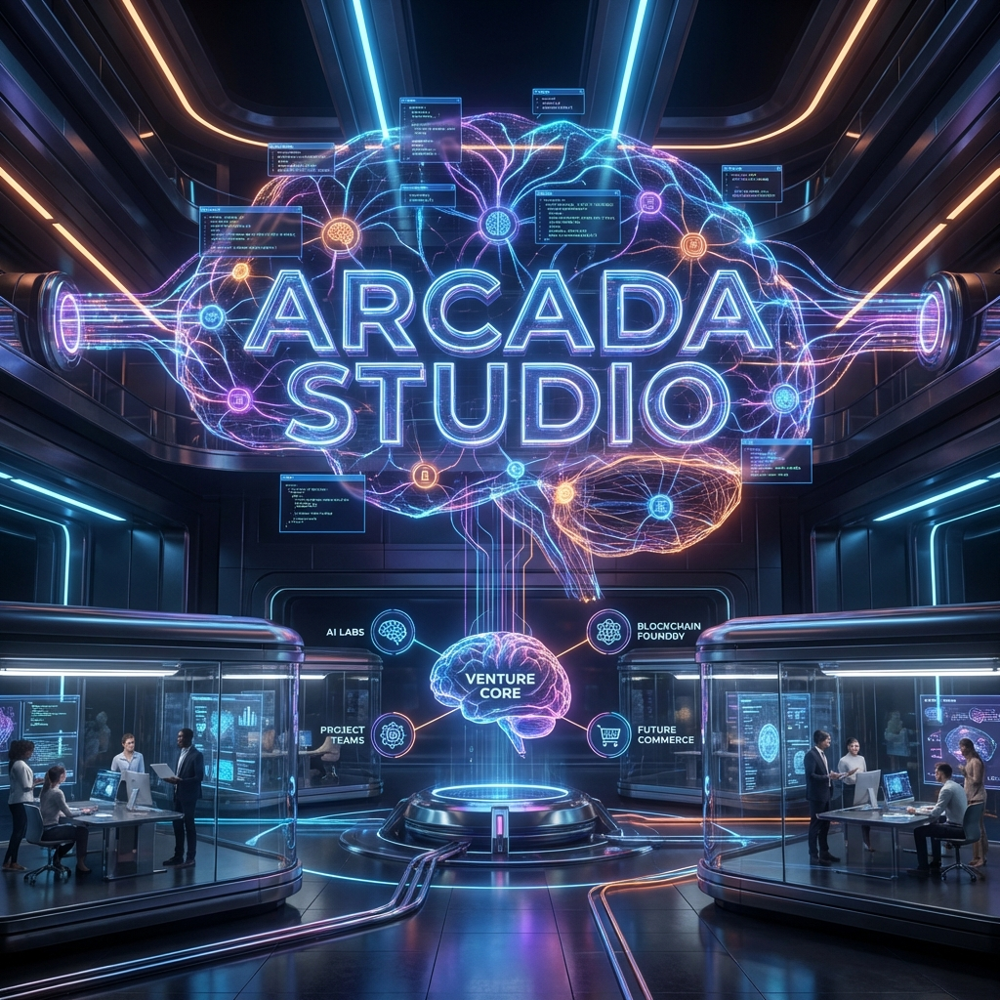

# Arcada Studio

> **Engineering the Future at the Speed of Thought.**
> *A Next-Generation Venture Builder & Industrial R&D Hub.*

---

## 🌌 The Mission

Arcada Studio is not just a software house; it is a **Neural Command Center**. We operate at the bleeding edge of **Generative AI**, **Autonomous Agents**, and **High-Performance Engineering** to build the future of software.

Existing paradigms of development are too slow for the exponential age. We are rewriting the playbook. Our mission is to compress years of R&D into weeks by leveraging a proprietary ecosystem of AI agents that architect, code, and deploy solutions autonomously.

**We don't just build products. We build the intelligence that builds products.**

---

## ⚔️ Capabilities & Services

### 1. Neural Venture Building
We incubate and launch our own AI-native startups. From "Zero-to-One", we handle everything:
*   **Strategy & Architecting**: Validating product-market fit with predictive analytics.
*   **Rapid Prototyping**: Deploying MVPs in days, not months.
*   **Scale**: Building on serverless infrastructure designed for millions of users.

### 2. Autonomous Agent Systems
We engineer the workforce of tomorrow.
*   **Multi-Agent Orchestration**: Systems where "Scout", "Architect", and "Coder" agents collaborate.
*   **Generative UI/UX**: Interfaces that redraw themselves in real-time based on user intent.
*   **Advanced RAG & Vector Search**: Creating corporate brains that never forget.

### 3. Industrial R&D
We partner with select enterprises to solve "impossible" technical challenges.
*   **Cyber-Physical Systems**: Bridging software with hardware control.
*   **Predictive Logistics**: AI models that optimize supply chains before bottlenecks happen.
*   **Secure Infrastructure**: Military-grade security protocols for sensitive data environments.

---

## 🛠 The Tech Stack
Our engineering philosophy is **Speed, Safety, and Scalability**.

| Layer | Technologies |
| :--- | :--- |
| **Intelligence** | Vertex AI, Gemini 1.5 Pro, Imagen 3, Custom LLM Fine-tuning |
| **Frontend** | Next.js 15 (App Router), React 19, TailwindCSS, Framer Motion |
| **Backend** | Google Cloud Platform, Firebase (Functions v2, Firestore), Node.js |
| **Search** | Vector Embeddings, Algolia, Typesense |
| **Governance** | Strict TypeScript, CI/CD Pipelines, Automated Testing |

---

## 🌐 Connect With The Hub

We are always looking for visionary founders, world-class engineers, and forward-thinking partners.

| Platform | Coordinates |
| :--- | :--- |
| **Official Headquarters** | [www.arcadallc.com](https://www.arcadallc.com) |
| **LinkedIn Channel** | [Arcada Studio Lab](https://www.linkedin.com/company/arcadastudiolab/) |
| **Visual Transmissions** | [YouTube Channel](https://www.youtube.com/channel/UCRU7yx7UCyXrnGNYRUkJExQ) |

---

> *"The best way to predict the future is to invent it."*

*© 2026 Arcada Studio LLC. All Systems Operational.*
*Registered Entity ID: US-NM-2026-ARC | Status: Active*
